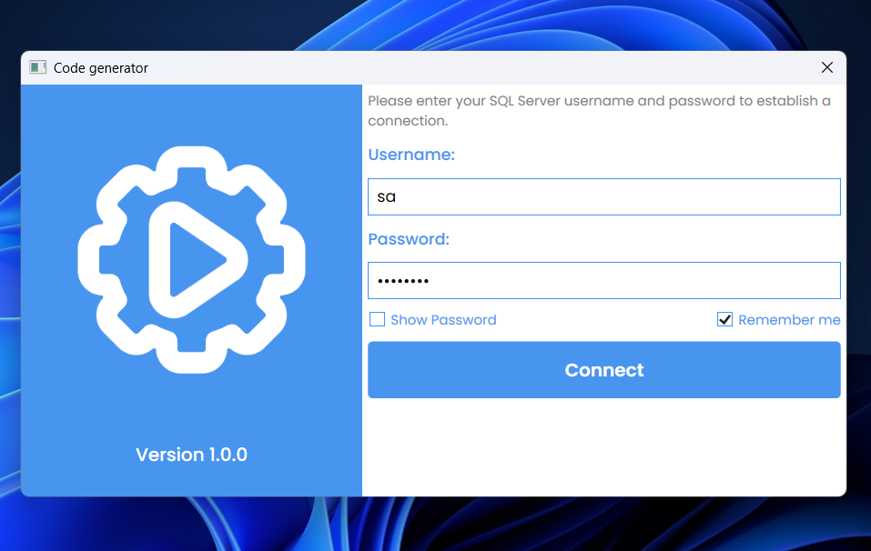
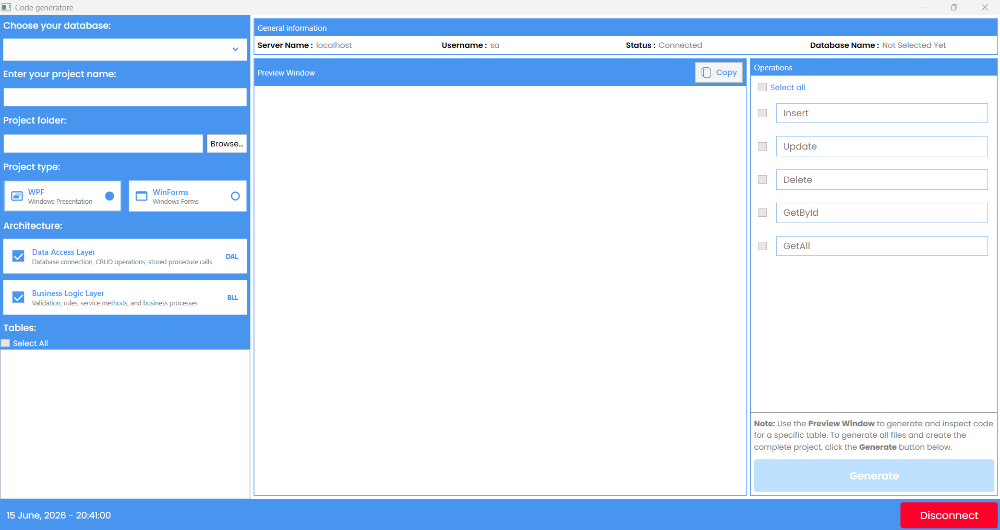
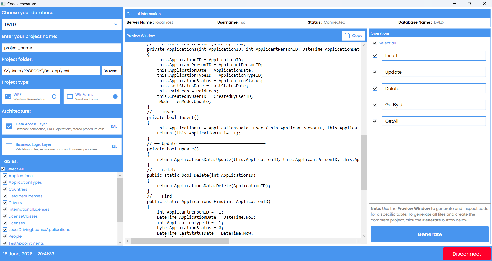
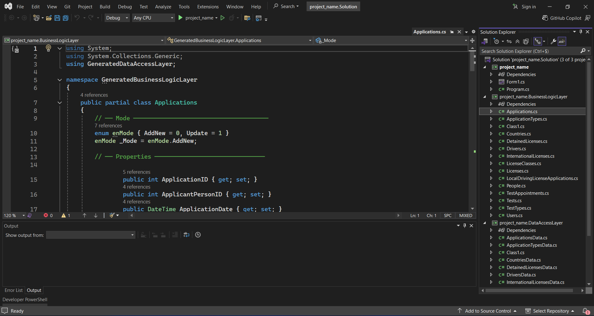

# 🚀 Code Generator v1

A desktop application that automates the generation of boilerplate code for multi-layered .NET applications. The tool connects to a SQL Server database, analyzes tables, and generates Data Access Layer (DAL) and Business Logic Layer (BLL) code automatically, significantly reducing repetitive development work.

---

## ✨ Features

### 🏗️ Project Generation

* Automatically creates the project structure based on the specified project name.
* Generates projects in a predefined folder structure.
* Supports both **Windows Forms** and **WPF** project types.
* Generates ready-to-open **`.csproj`** files for Visual Studio.

### 📦 Layer Selection

* Choose which layers to generate.
* Generate:

  * Data Access Layer (DAL)
  * Business Logic Layer (BLL)

### 🔄 Code Regeneration

* Regenerate code for a specific database table without regenerating the entire project.

### ⚙️ CRUD Operation Selection

* Select which CRUD operations should be generated:

  * Create
  * Read
  * Update
  * Delete
* Supports generating only the operations required by the user.

### 🧠 Smart Code Generation

* Automatically handles nullable SQL data types.
* Generates strongly-typed C# classes and methods.
* Reduces manual coding and repetitive tasks.

### 👀 Preview Window

Before generating code, users can preview:

* Generated C# Classes

The side-by-side preview helps verify the output and builds confidence before code generation.

---

## 📸 Screenshots

---

## 🛠️ Technologies Used

| Layer | Technology |
|-------|------------|
| Language | C# |
| Framework | .NET |
| UI | Windows Presentation Foundation (WPF) |
| Database | SQL Server |
| Architecture | Layered (Three-tier architecture) / OOP Design |

---

## 🎯 Use Cases

This tool is useful for:

* Rapid application development.
* Learning layered architecture.
* Generating DAL/BLL boilerplate code.
* Creating CRUD-based business applications.
* Reducing repetitive coding tasks.
* Standardizing project structure across multiple projects.

---

## 🚀 Getting Started

1. Launch the application.
2. Connect to your SQL Server database.
3. Select the desired project type:

   * Windows Forms
   * WPF
4. Choose the layers to generate.
5. Select the tables and CRUD operations.
6. Preview the generated code.
7. Click **Generate**.
8. Open the generated solution in Visual Studio and start developing.

---

## 👨‍💻 Author

**Yacine Ragueb**
 
- LinkedIn: [@yacineragueb](https://www.linkedin.com/in/yacine-ragueb-8033a9302/)
- My Website: [yacineragueb](https://yacineragueb.vercel.app/)
- Email: yacineddd32@gmail.com
